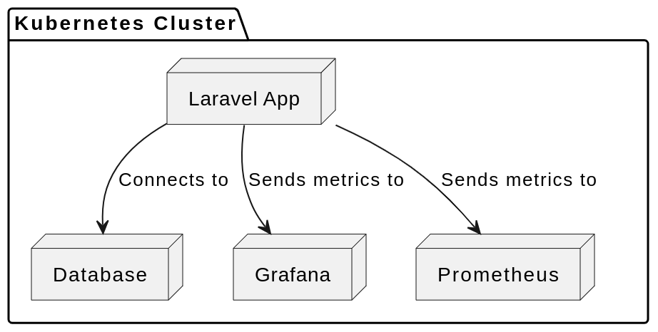

## Laravel App - CRUD Services 

This application run the service of Laravel CRUD Application with the database server. Include with the monitoring services using Prometheus and Grafana.

The application it self contain of : 
- Laravel Apps Directory
- Dockerfile and Docker compose script
- Helm chart for deploying locally
- Github Actions Workflow

The configuration of the deployment to Kubernetes, it's using such as: 
- Health Checks
- Horizontal Pod Autoscaling; While the container down, there are some backup to make the pods running up again.

The monitoring setup with the Helm chart using Prometheus and Grafana, which that also could monitor the Laravel apps
Default of the dashboard itself using Laravel App Metrics.

The monitoring process its using the default of Kubernetes system, with health checks to show the process of the pods itself

To run this app, you can try with:

If you want to run separately, such as to work with the container itself and database container, you can try with: 
```
docker pull mrfzy00/crud_laravel_api-sre-test-app:latest
docker run -d -p 8000:8000 --name <the container name> crud_laravel_api-sre-test-app

# To run the database you can start:
docker-compose up -d
```
Or you would try with run the app combined with docker compose its okay

And for the Minikube cluster here's the setup to do it: 

```
# Start the application first to deploy the Laravel and the MySQL

helm install <application-name> .

# First we need to check the IP for both pods, which that is the webapp and the database server

kubectl get pods

kubectl describe pod <laravel-pod-name>
kubectl describe pod <laravel-pod-mysql-db>

# After that we execute inside the pod of Laravel Application

kubectl exec -it <laravel-pod-name> bash


# Fill out the environment of the .env Laravel application with this value
APP_NAME=Laravel
APP_ENV=local
APP_KEY=<laravel-app-key> # We need to generate this manually with php artisan key:generate
APP_DEBUG=true
APP_URL=http://localhost/login

DB_CONNECTION=mysql
DB_HOST=<ip-of-laravel-mysql-db-pod>
DB_PORT=<pod-port>
DB_DATABASE=<db-name>
DB_USERNAME=<db-username>
DB_PASSWORD=<db-password>

# After we change the value we do this inside the pod

php artisan migrate

# After that we try to access the pod of Laravel application

kubectl port-forward <laravel-app-pod> 80 8000

# Access the application with

http://localhost:8000


# Add Helm Repositories
helm repo add prometheus-community https://prometheus-community.github.io/helm-charts
helm repo add grafana https://grafana.github.io/helm-charts
helm repo update

# Install Prometheus
helm install prometheus prometheus-community/prometheus

# Install Grafana
helm install grafana grafana/grafana


```

The database will start the service itself


